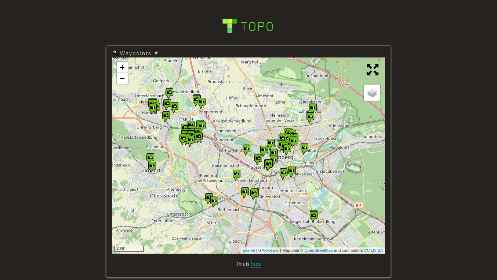

 
## About Topo

Topo is a simple PHP application to map photos on Openstreetmap. Topo relies on the [GPX Viewer](https://www.j-berkemeier.de/GPXViewer/) JavaScript library.

The [Linux Photography](https://gumroad.com/l/linux-photography) book provides detailed information on using Topo. Get your copy at [Google Play Store](https://play.google.com/store/books/details/Dmitri_Popov_Linux_Photography?id=cO70CwAAQBAJ) or [Gumroad](https://gumroad.com/l/linux-photography).

## Requirements

* A web server with PHP7 or higher (Tested with Apache and lighttpd)
* PHP libraries: exif
* Git (optional)

## Installation and usage

1. Install the required packages. On Ubuntu and Linux Mint, this can be done by running the following command: `sudo apt install apache2 php php-exif git`
2. In the terminal, switch to the root directory of the server (for example, _/var/www/html_) and use the `sudo git clone https://github.com/dmpop/topo.git` command to fetch the latest source code. Alternatively, you can download the ZIP archive and extract it into the document root of the server.
3. Open the _index.php_ file in a text editor and specify the path to the directory containing geotagged photos.
4. Make the _topo_ directory writable by the server using the `sudo chown www-data -R topo` command as root.
5. Point the browser to _http://127.0.0.1/topo/_ (replace *127.0.0.1* with the actual IP address or domain name of your server).

## Author

Dmitri Popov ([dmpop@linux.com](mailto:dmpop@linux.com))

## License

Topo is released under the [Attribution-NonCommercial-ShareAlike 4.0 International](https://creativecommons.org/licenses/by-nc-sa/4.0/) license.
